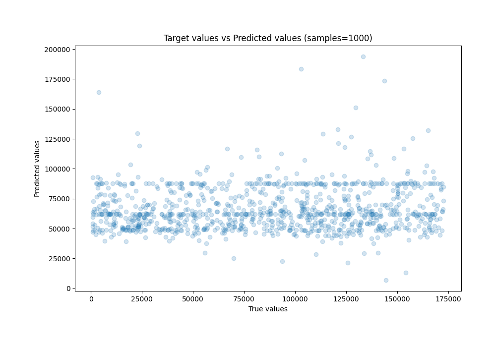

# Summary of 5_Default_NeuralNetwork_GoldenFeatures

[<< Go back](../README.md)

## Neural Network
- **n_jobs**: -1
- **dense_1_size**: 32
- **dense_2_size**: 16
- **learning_rate**: 0.05
- **explain_level**: 1

## Validation
 - **validation_type**: kfold
 - **k_folds**: 5
 - **shuffle**: True

## Optimized metric
rmse

## Training time

9.6 seconds

### Metric details:
| Metric   |           Score |
|:---------|----------------:|
| MAE      | 46604.2         |
| MSE      |     3.07398e+09 |
| RMSE     | 55443.5         |
| R2       |    -0.230502    |
| MAPE     |     2.04139     |

## Learning curves

## Permutation-based Importance

## True vs Predicted

## Predicted vs Residuals

[<< Go back](../README.md)
