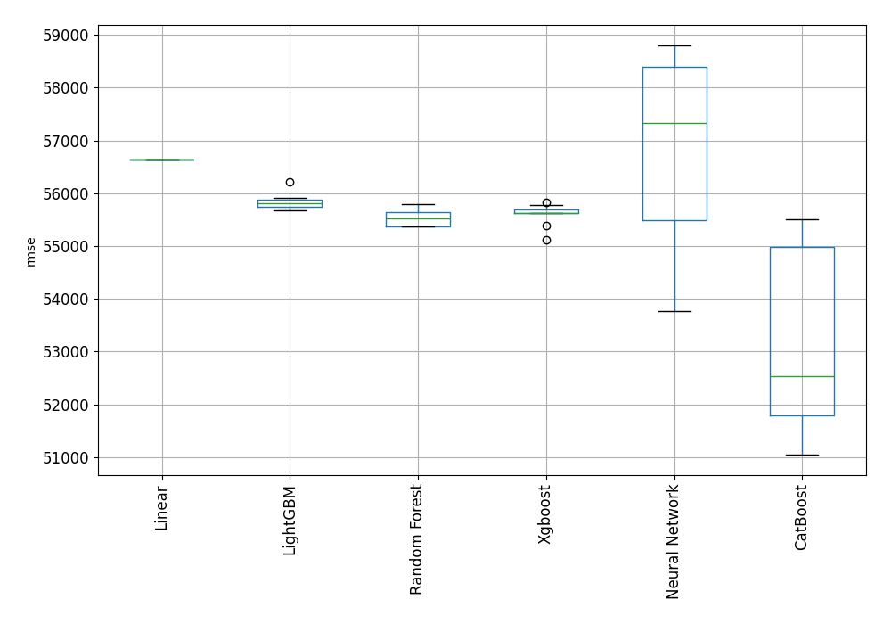

# AutoML Leaderboard

| Best model   | name                                                                                                 | model_type     | metric_type   |   metric_value |   train_time |   single_prediction_time |
|:-------------|:-----------------------------------------------------------------------------------------------------|:---------------|:--------------|---------------:|-------------:|-------------------------:|
|              | [1_Linear](1_Linear/README.md)                                                                       | Linear         | rmse          |        56630.9 |         7.08 |                   0.1054 |
|              | [2_Default_LightGBM](2_Default_LightGBM/README.md)                                                   | LightGBM       | rmse          |        55893.6 |         8.62 |                   0.1099 |
|              | [3_Default_Xgboost](3_Default_Xgboost/README.md)                                                     | Xgboost        | rmse          |        55685.8 |         8.77 |                   0.0997 |
|              | [4_Default_CatBoost](4_Default_CatBoost/README.md)                                                   | CatBoost       | rmse          |        55122.6 |        13.42 |                   0.0586 |
|              | [5_Default_NeuralNetwork](5_Default_NeuralNetwork/README.md)                                         | Neural Network | rmse          |        53763.4 |         7.35 |                   0.1387 |
|              | [6_Default_RandomForest](6_Default_RandomForest/README.md)                                           | Random Forest  | rmse          |        55622.9 |        32.91 |                   0.2089 |
|              | [11_LightGBM](11_LightGBM/README.md)                                                                 | LightGBM       | rmse          |        55819.7 |         7.77 |                   0.0829 |
|              | [7_Xgboost](7_Xgboost/README.md)                                                                     | Xgboost        | rmse          |        55825.2 |        10.57 |                   0.0777 |
|              | [15_CatBoost](15_CatBoost/README.md)                                                                 | CatBoost       | rmse          |        55355.1 |        33.48 |                   0.146  |
|              | [19_RandomForest](19_RandomForest/README.md)                                                         | Random Forest  | rmse          |        55430.5 |        29.77 |                   0.5207 |
|              | [23_NeuralNetwork](23_NeuralNetwork/README.md)                                                       | Neural Network | rmse          |        57657.2 |         5.44 |                   0.1872 |
|              | [12_LightGBM](12_LightGBM/README.md)                                                                 | LightGBM       | rmse          |        56216.1 |         5.48 |                   0.1318 |
|              | [8_Xgboost](8_Xgboost/README.md)                                                                     | Xgboost        | rmse          |        55625.5 |        13    |                   0.1105 |
|              | [16_CatBoost](16_CatBoost/README.md)                                                                 | CatBoost       | rmse          |        52570.7 |        20.91 |                   0.0561 |
|              | [20_RandomForest](20_RandomForest/README.md)                                                         | Random Forest  | rmse          |        55612.3 |        24.84 |                   0.3144 |
|              | [24_NeuralNetwork](24_NeuralNetwork/README.md)                                                       | Neural Network | rmse          |        58441.1 |         8    |                   0.1029 |
|              | [13_LightGBM](13_LightGBM/README.md)                                                                 | LightGBM       | rmse          |        55808.2 |         6.71 |                   0.0968 |
|              | [9_Xgboost](9_Xgboost/README.md)                                                                     | Xgboost        | rmse          |        55619.6 |         8.16 |                   0.097  |
|              | [17_CatBoost](17_CatBoost/README.md)                                                                 | CatBoost       | rmse          |        55284.1 |        17.77 |                   0.1609 |
|              | [21_RandomForest](21_RandomForest/README.md)                                                         | Random Forest  | rmse          |        55694   |        28.81 |                   0.2047 |
|              | [25_NeuralNetwork](25_NeuralNetwork/README.md)                                                       | Neural Network | rmse          |        58804.3 |         4.41 |                   0.0859 |
|              | [14_LightGBM](14_LightGBM/README.md)                                                                 | LightGBM       | rmse          |        55915.6 |         5.16 |                   0.0633 |
|              | [10_Xgboost](10_Xgboost/README.md)                                                                   | Xgboost        | rmse          |        55117   |         4.76 |                   0.0716 |
|              | [18_CatBoost](18_CatBoost/README.md)                                                                 | CatBoost       | rmse          |        52235.8 |        13.56 |                   0.072  |
|              | [22_RandomForest](22_RandomForest/README.md)                                                         | Random Forest  | rmse          |        55789.3 |        17.42 |                   0.1571 |
|              | [26_NeuralNetwork](26_NeuralNetwork/README.md)                                                       | Neural Network | rmse          |        58576.5 |         4.07 |                   0.0888 |
|              | [18_CatBoost_GoldenFeatures](18_CatBoost_GoldenFeatures/README.md)                                   | CatBoost       | rmse          |        54269.5 |        19.44 |                   0.1172 |
|              | [16_CatBoost_GoldenFeatures](16_CatBoost_GoldenFeatures/README.md)                                   | CatBoost       | rmse          |        51837.7 |        30.35 |                   0.2875 |
|              | [5_Default_NeuralNetwork_GoldenFeatures](5_Default_NeuralNetwork_GoldenFeatures/README.md)           | Neural Network | rmse          |        55443.5 |        11.69 |                   0.5319 |
|              | [16_CatBoost_GoldenFeatures_RandomFeature](16_CatBoost_GoldenFeatures_RandomFeature/README.md)       | CatBoost       | rmse          |        52493.8 |        30.45 |                   0.1583 |
|              | [16_CatBoost_GoldenFeatures_SelectedFeatures](16_CatBoost_GoldenFeatures_SelectedFeatures/README.md) | CatBoost       | rmse          |        51657   |         5.75 |                   0.0549 |
|              | [5_Default_NeuralNetwork_SelectedFeatures](5_Default_NeuralNetwork_SelectedFeatures/README.md)       | Neural Network | rmse          |        55657.4 |         4.01 |                   0.0658 |
|              | [10_Xgboost_SelectedFeatures](10_Xgboost_SelectedFeatures/README.md)                                 | Xgboost        | rmse          |        55621.4 |         4.78 |                   0.0432 |
|              | [19_RandomForest_SelectedFeatures](19_RandomForest_SelectedFeatures/README.md)                       | Random Forest  | rmse          |        55374   |         8.9  |                   0.177  |
|              | [13_LightGBM_SelectedFeatures](13_LightGBM_SelectedFeatures/README.md)                               | LightGBM       | rmse          |        55715.9 |         4.46 |                   0.0375 |
| **the best** | [27_CatBoost_GoldenFeatures_SelectedFeatures](27_CatBoost_GoldenFeatures_SelectedFeatures/README.md) | CatBoost       | rmse          |        51052.6 |         4.94 |                   0.0516 |
|              | [28_CatBoost_GoldenFeatures_SelectedFeatures](28_CatBoost_GoldenFeatures_SelectedFeatures/README.md) | CatBoost       | rmse          |        51993.2 |         6.83 |                   0.0691 |
|              | [29_CatBoost_GoldenFeatures](29_CatBoost_GoldenFeatures/README.md)                                   | CatBoost       | rmse          |        51297.9 |        13.68 |                   0.148  |
|              | [30_CatBoost_GoldenFeatures](30_CatBoost_GoldenFeatures/README.md)                                   | CatBoost       | rmse          |        52791.8 |        42.54 |                   0.0978 |
|              | [31_NeuralNetwork](31_NeuralNetwork/README.md)                                                       | Neural Network | rmse          |        56987.6 |         4.67 |                   0.0521 |
|              | [32_Xgboost](32_Xgboost/README.md)                                                                   | Xgboost        | rmse          |        55388.8 |         4.87 |                   0.051  |
|              | [33_RandomForest_SelectedFeatures](33_RandomForest_SelectedFeatures/README.md)                       | Random Forest  | rmse          |        55374   |         8.45 |                   0.1562 |
|              | [34_RandomForest](34_RandomForest/README.md)                                                         | Random Forest  | rmse          |        55370.1 |        57.48 |                   0.4147 |
|              | [35_NeuralNetwork_GoldenFeatures](35_NeuralNetwork_GoldenFeatures/README.md)                         | Neural Network | rmse          |        54367.8 |        31.38 |                   1.1378 |
|              | [36_NeuralNetwork_GoldenFeatures](36_NeuralNetwork_GoldenFeatures/README.md)                         | Neural Network | rmse          |        58263.5 |        35.21 |                   1.1813 |
|              | [37_Xgboost](37_Xgboost/README.md)                                                                   | Xgboost        | rmse          |        55637.1 |        49.6  |                   0.2829 |
|              | [38_Xgboost](38_Xgboost/README.md)                                                                   | Xgboost        | rmse          |        55779.8 |        49.99 |                   1.3651 |
|              | [39_LightGBM_SelectedFeatures](39_LightGBM_SelectedFeatures/README.md)                               | LightGBM       | rmse          |        55680.4 |        33.39 |                   0.0895 |
|              | [40_LightGBM_SelectedFeatures](40_LightGBM_SelectedFeatures/README.md)                               | LightGBM       | rmse          |        55715.9 |        28.16 |                   0.1164 |
|              | [41_LightGBM](41_LightGBM/README.md)                                                                 | LightGBM       | rmse          |        55810.2 |        45.83 |                   0.2785 |
|              | [42_LightGBM](42_LightGBM/README.md)                                                                 | LightGBM       | rmse          |        55808.2 |        48.62 |                   0.25   |
|              | [43_CatBoost_GoldenFeatures_SelectedFeatures](43_CatBoost_GoldenFeatures_SelectedFeatures/README.md) | CatBoost       | rmse          |        55500.2 |        20.76 |                   1.5317 |
|              | [44_CatBoost_GoldenFeatures_SelectedFeatures](44_CatBoost_GoldenFeatures_SelectedFeatures/README.md) | CatBoost       | rmse          |        51578.7 |        29.83 |                   0.1722 |
|              | [45_CatBoost_GoldenFeatures](45_CatBoost_GoldenFeatures/README.md)                                   | CatBoost       | rmse          |        54936.9 |        43.53 |                   1.142  |

### AutoML Performance

### AutoML Performance Boxplot
