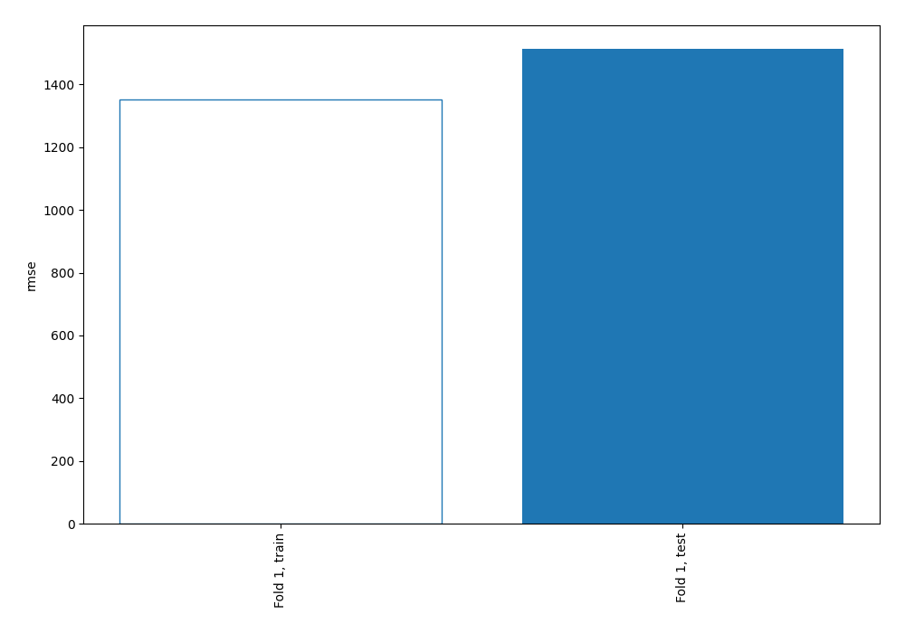
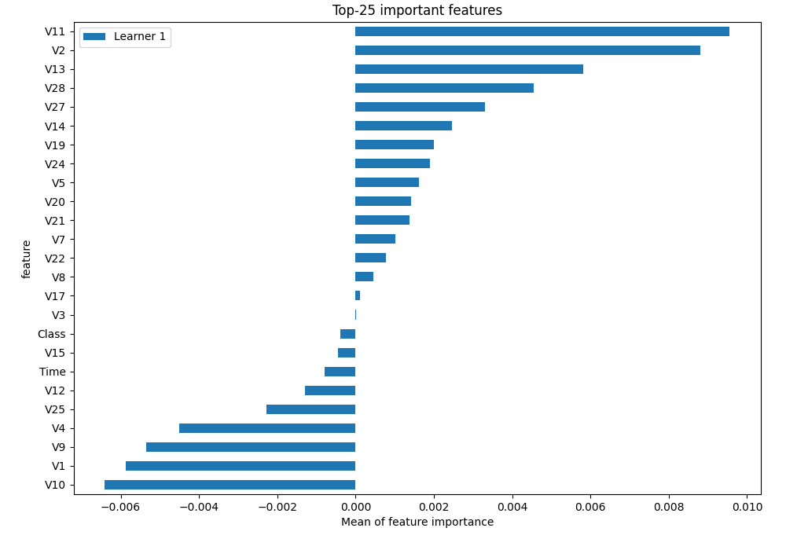
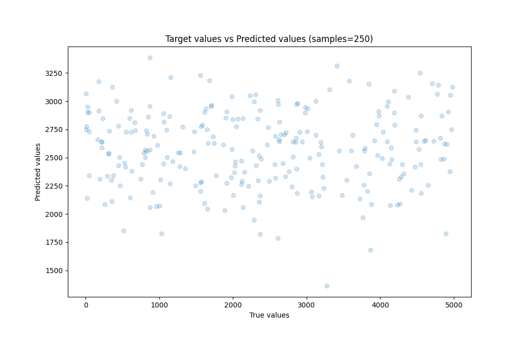
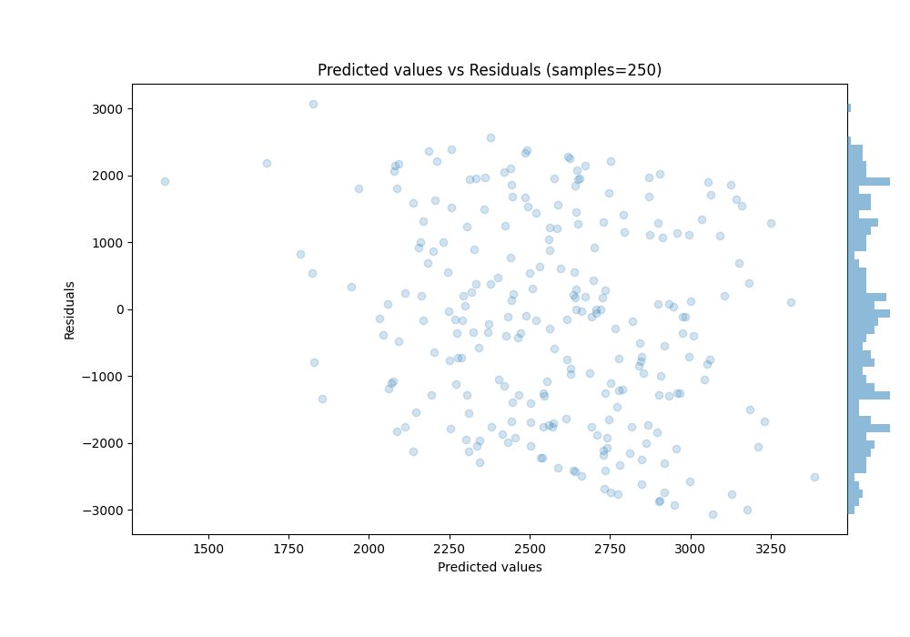
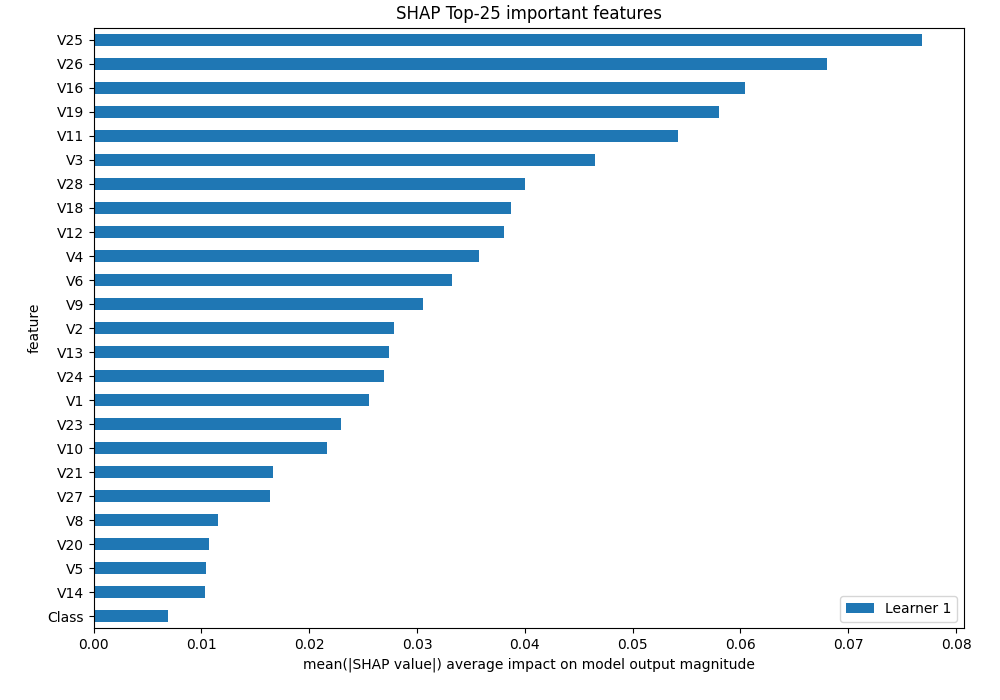
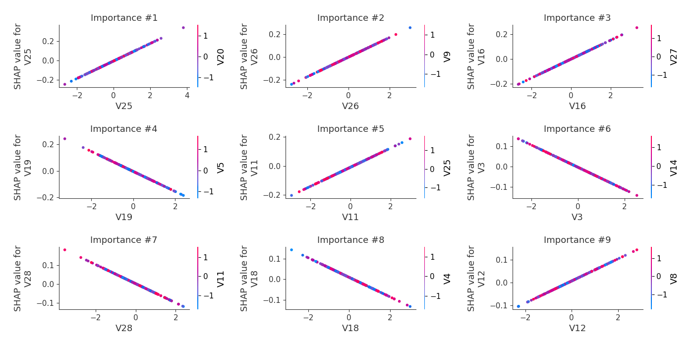
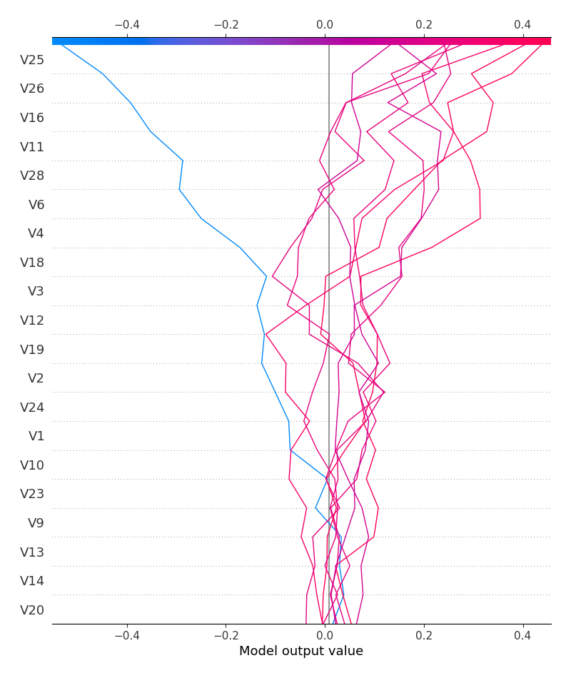
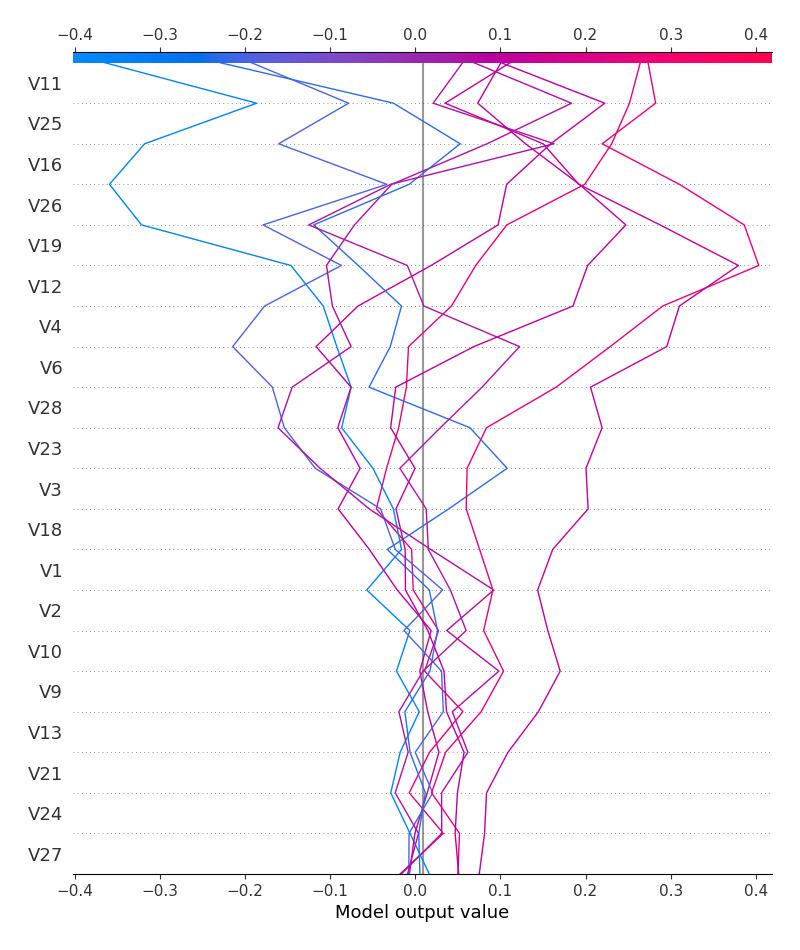

# Summary of 3_Linear

[<< Go back](../README.md)

## Linear Regression (Linear)
- **n_jobs**: -1
- **explain_level**: 2

## Validation
 - **validation_type**: split
 - **train_ratio**: 0.75
 - **shuffle**: True

## Optimized metric
rmse

## Training time

9.9 seconds

### Metric details:
| Metric   |          Score |
|:---------|---------------:|
| MAE      | 1282.57        |
| MSE      |    2.28949e+06 |
| RMSE     | 1513.11        |
| R2       |   -0.0699987   |
| MAPE     |    7.36202     |

## Learning curves

## Coefficients
| feature   |   Learner_1 |
|:----------|------------:|
| V25       |  0.0908465  |
| V26       |  0.0857661  |
| V16       |  0.0757411  |
| V11       |  0.0662835  |
| V12       |  0.0484719  |
| V13       |  0.0360582  |
| V2        |  0.0349168  |
| V24       |  0.0323894  |
| V23       |  0.0323108  |
| V27       |  0.0204339  |
| V21       |  0.0190998  |
| V8        |  0.014318   |
| V5        |  0.0141311  |
| V20       |  0.0136654  |
| V14       |  0.012807   |
| intercept |  0.0105172  |
| V7        |  0.00672383 |
| V22       |  0.00641448 |
| Time      |  0.00426694 |
| V17       | -0.00236397 |
| V15       | -0.00246543 |
| V10       | -0.0242216  |
| V1        | -0.0335037  |
| V9        | -0.0370957  |
| V6        | -0.0373648  |
| V4        | -0.0430787  |
| V18       | -0.0474564  |
| V28       | -0.0508795  |
| V3        | -0.0549587  |
| V19       | -0.075781   |
| Class     | -0.167533   |

## Permutation-based Importance

## True vs Predicted

## Predicted vs Residuals

## SHAP Importance

## SHAP Dependence plots

### Dependence (Fold 1)

## SHAP Decision plots

### Top-10 Worst decisions (Fold 1)

### Top-10 Best decisions (Fold 1)

[<< Go back](../README.md)
