# Summary of 3_Linear

[<< Go back](../README.md)

## Logistic Regression (Linear)
- **n_jobs**: -1
- **explain_level**: 2

## Validation
 - **validation_type**: split
 - **train_ratio**: 0.75
 - **shuffle**: True
 - **stratify**: True

## Optimized metric
logloss

## Training time

5.3 seconds

## Metric details
|           |    score |   threshold |
|:----------|---------:|------------:|
| logloss   | 0.110733 | nan         |
| auc       | 1        | nan         |
| f1        | 1        |   0.415144  |
| accuracy  | 1        |   0.415144  |
| precision | 1        |   0.415144  |
| recall    | 1        |   0.0108132 |
| mcc       | 1        |   0.415144  |

## Metric details with threshold from accuracy metric
|           |    score |   threshold |
|:----------|---------:|------------:|
| logloss   | 0.110733 |  nan        |
| auc       | 1        |  nan        |
| f1        | 1        |    0.415144 |
| accuracy  | 1        |    0.415144 |
| precision | 1        |    0.415144 |
| recall    | 1        |    0.415144 |
| mcc       | 1        |    0.415144 |

## Confusion matrix (at threshold=0.415144)
|              |   Predicted as 0 |   Predicted as 1 |
|:-------------|-----------------:|-----------------:|
| Labeled as 0 |                5 |                0 |
| Labeled as 1 |                0 |                5 |

## Learning curves
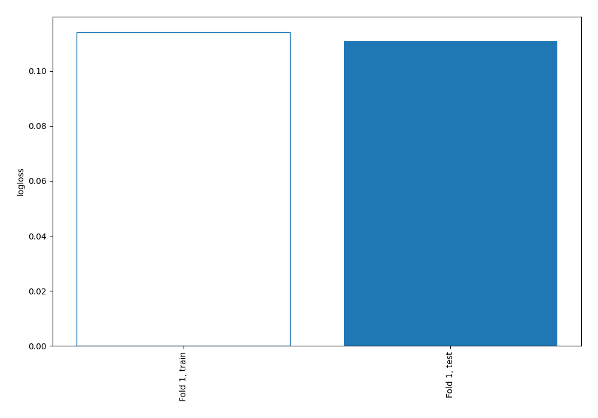

## Coefficients
| feature         |   Learner_1 |
|:----------------|------------:|
| credit_score    |    0.850574 |
| income          |    0.778794 |
| age             |    0.670672 |
| work_experience |    0.581764 |
| intercept       |    0.414639 |
| dependents      |    0.401084 |
| homeowner       |    0.101649 |
| education       |   -0.17937  |
| city_size       |   -0.761103 |

## Permutation-based Importance
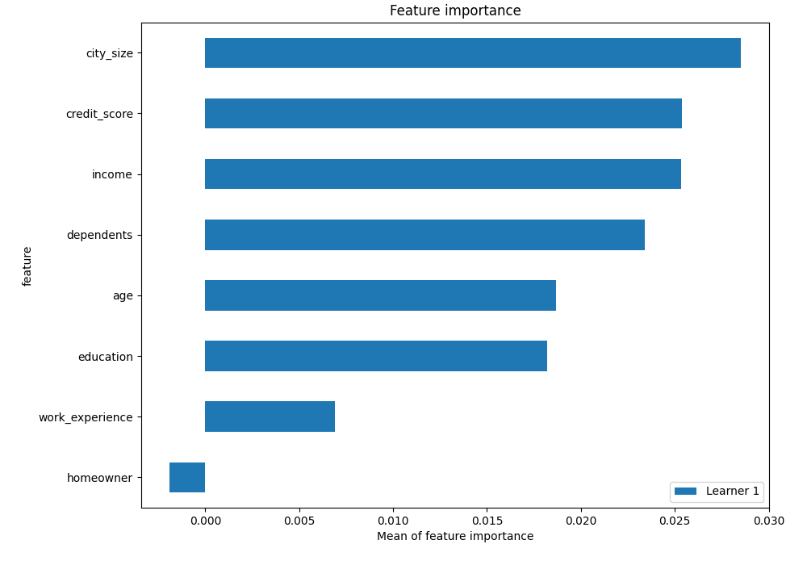
## Confusion Matrix

## Normalized Confusion Matrix

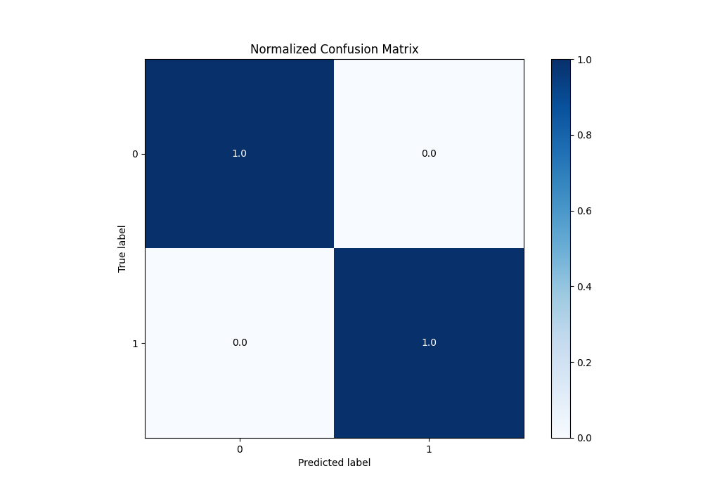

## ROC Curve

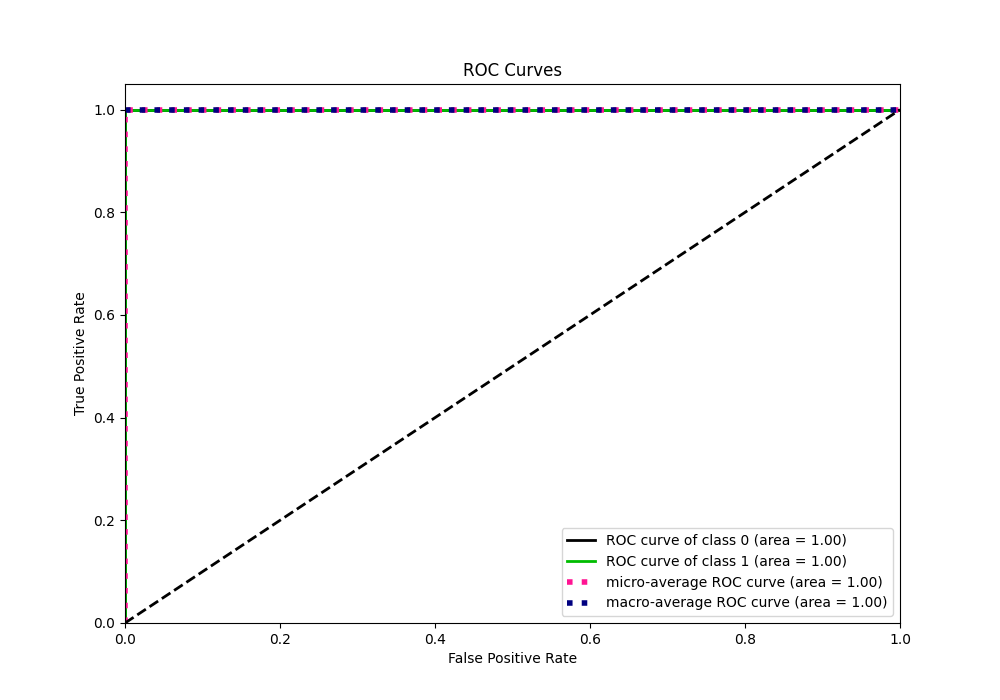

## Kolmogorov-Smirnov Statistic

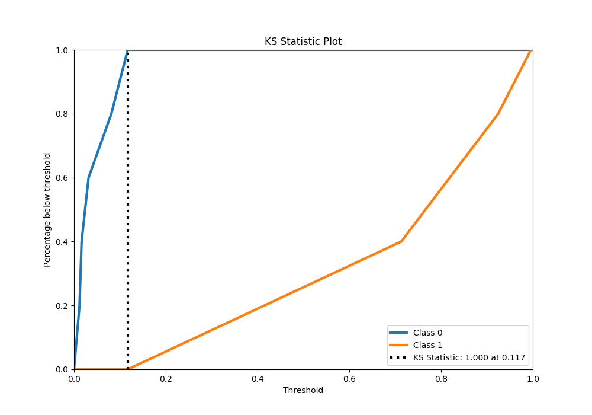

## Precision-Recall Curve

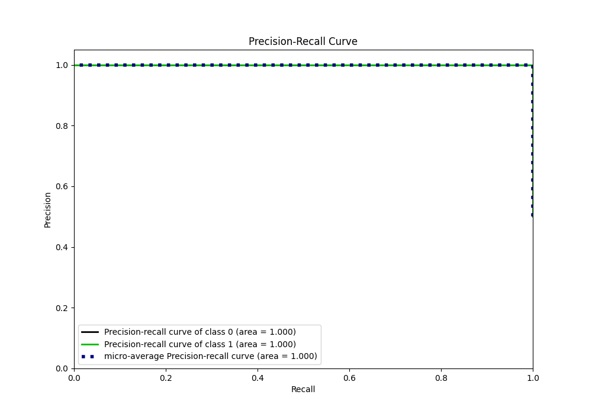

## Calibration Curve

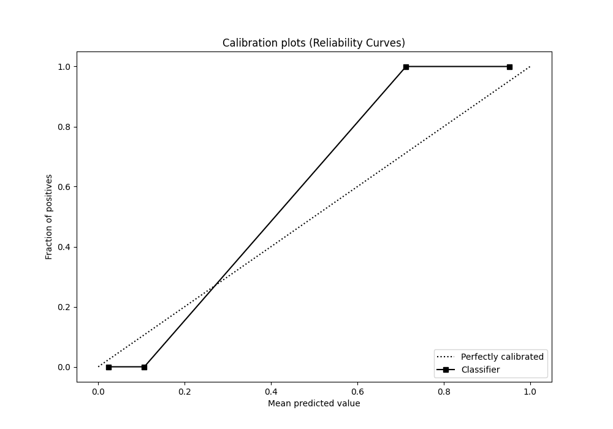

## Cumulative Gains Curve

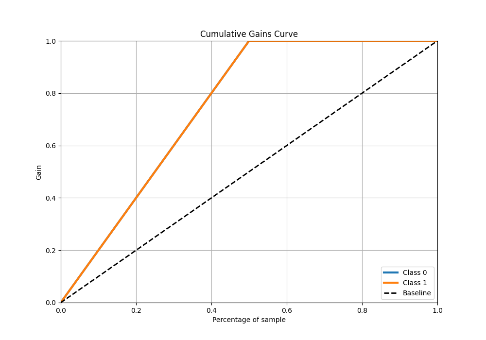

## Lift Curve

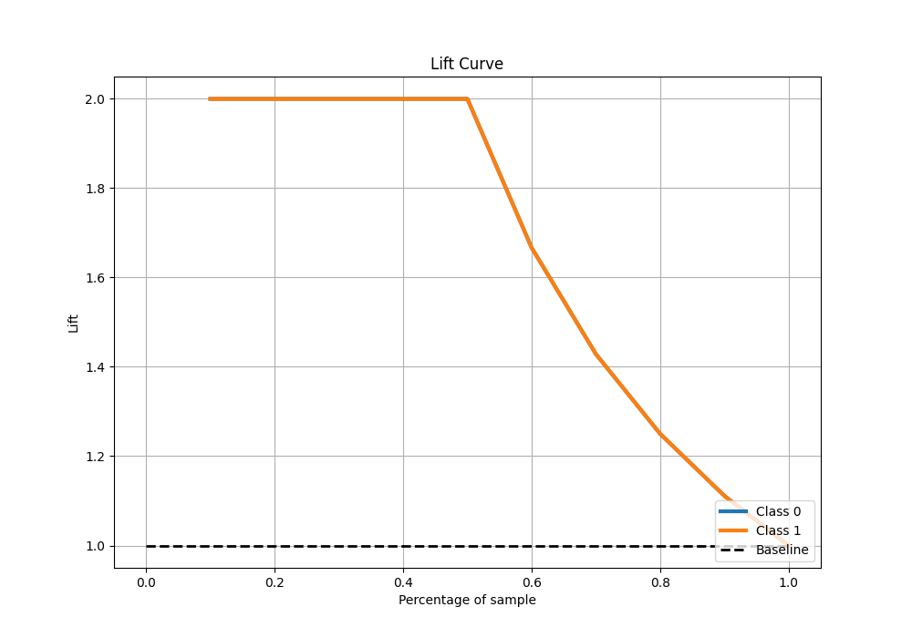

## SHAP Importance
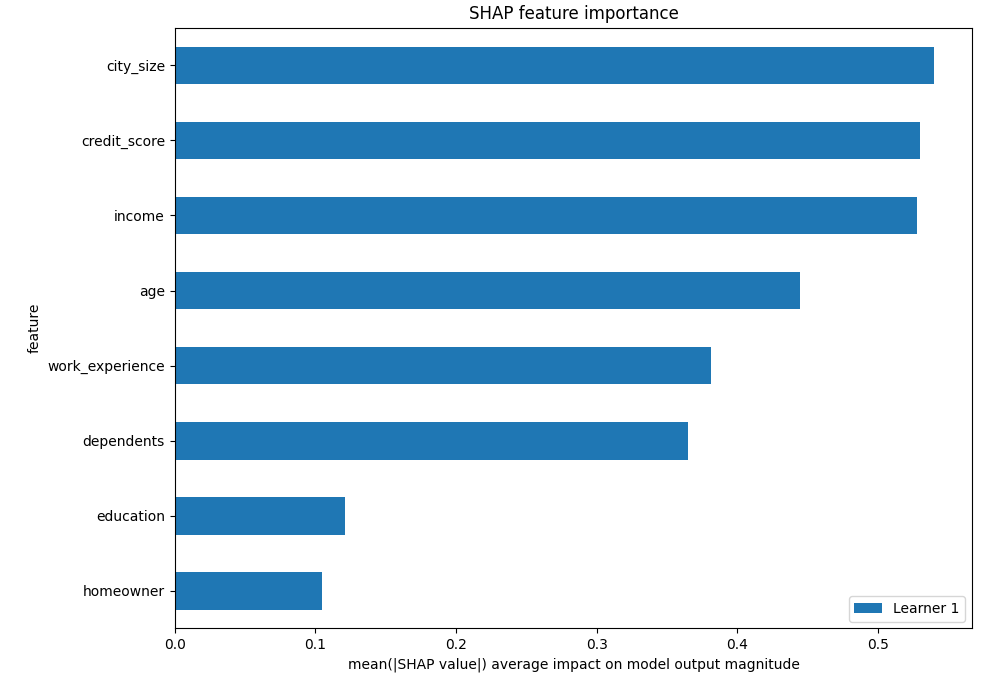

## SHAP Dependence plots

### Dependence (Fold 1)
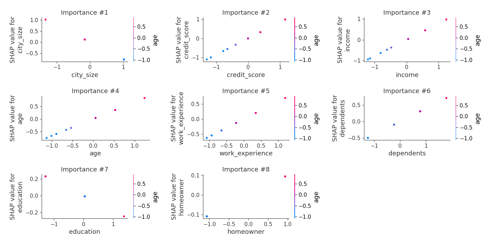

## SHAP Decision plots

### Top-10 Worst decisions for class 0 (Fold 1)

### Top-10 Best decisions for class 0 (Fold 1)
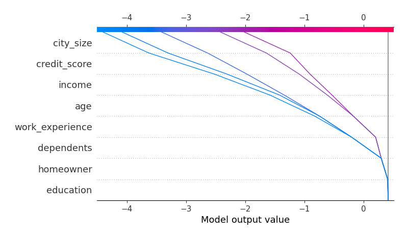
### Top-10 Worst decisions for class 1 (Fold 1)
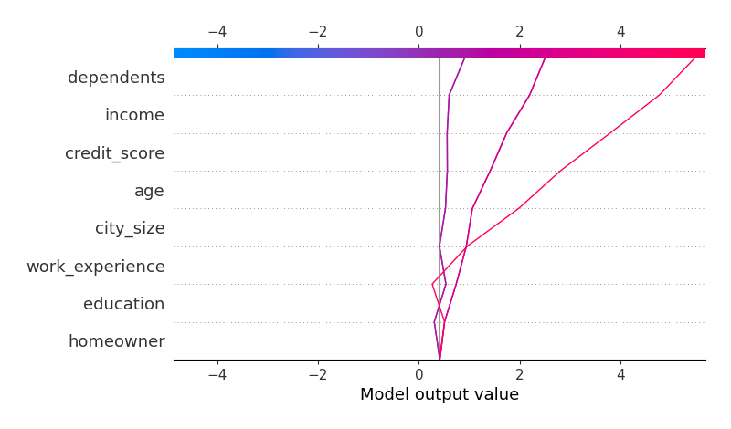
### Top-10 Best decisions for class 1 (Fold 1)

[<< Go back](../README.md)
